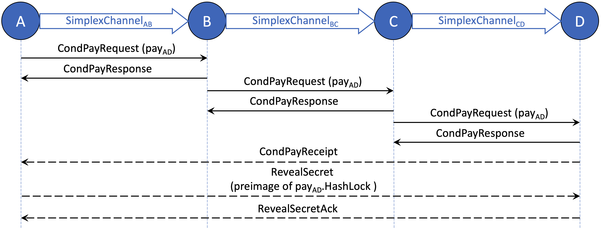
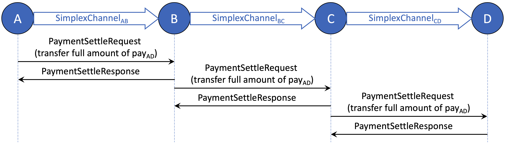
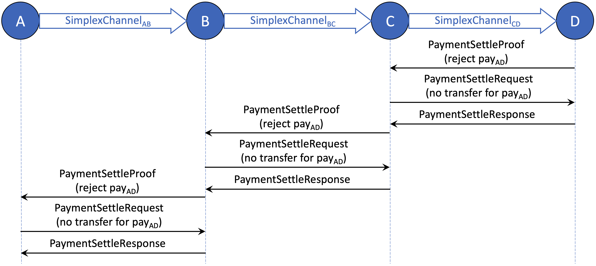
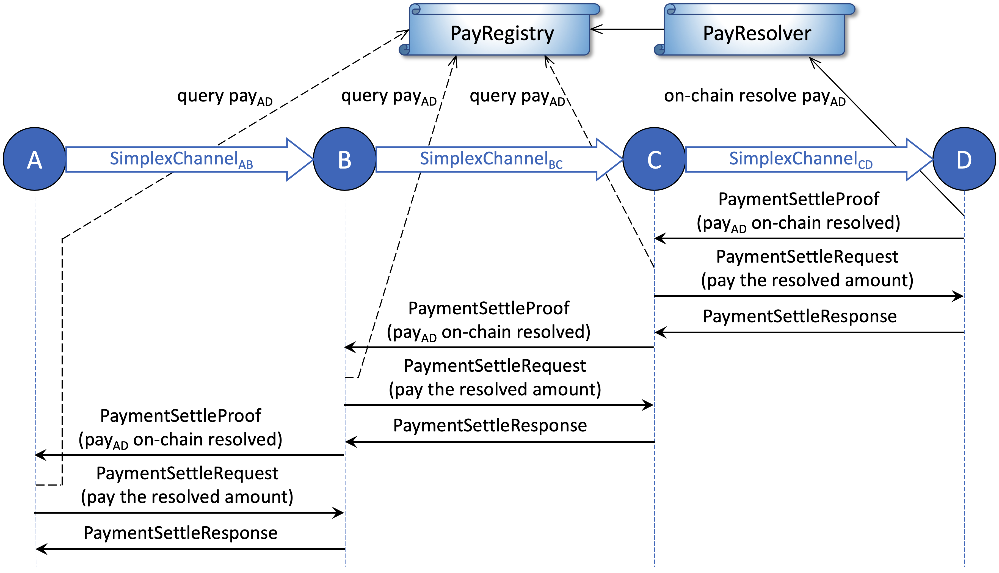
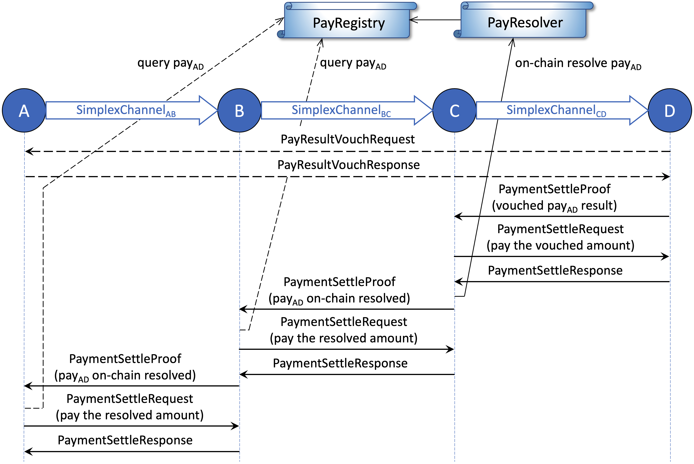

# End-to-End Protocols

This section describes the full lifecycle of **end-to-end multi-hop conditional payments** in AgentPay. As discussed earlier, AgentPay supports highly general conditional dependencies and flexible condition resolution functions. Two common types—[**boolean**](end-to-end-protocols.md#pay-with-boolean-conditions) **and** [**numeric**](end-to-end-protocols.md#pay-with-numeric-conditions) **transfer functions**—are implemented with optimized protocols and precompiled logic for efficiency.

Specialized end-to-end protocols can be derived and fine-tuned from the core single-hop conditional payment primitive, ensuring consistency across heterogeneous use cases while retaining high throughput.

The design follows the classic End-to-End Principle: most complexity resides at the network edge (payment source and destination), keeping the relay nodes lightweight and stateless. This approach enables simple, scalable, and robust relay implementations capable of supporting large-scale, high-frequency payment flows.

***

## Pay with Boolean Conditions

We start with the flow of **boolean-conditional payments**, which are expected to be the most common in practice. Because the condition outcomes are strictly _true_ or _false_, these payments always resolve to either the full amount or zero.

The end-to-end off-chain protocol follows AgentPay’s design principles — in particular, minimizing relay node on-chain interaction, on-chain view calls, and off-chain communication overhead.

For boolean-conditional payments, **relay nodes never need to interpret condition logic or perform any on-chain operation — even in the presence of malicious or offline participants along the route**. This makes the core payment network highly robust and scalable.

### **Properties of Boolean-Conditional Payments**

Guided by the end-to-end principle, the boolean payment protocol is designed with the following properties:

* **Simple:** Relay nodes are agnostic to application and condition logic.
* **Secure:** Relay nodes remain safe under arbitrary application or condition behaviors.
* **Robust:** Relay nodes never need to monitor on-chain payment or condition states.
* **Low on-chain cost:** Relay nodes never initiate on-chain disputes.
* **Low off-chain overhead:** Relay nodes do not modify payment messages, and the number of message exchanges is minimized for both cooperative and uncooperative cases.

### **Set up end-to-end conditional payment**

The setup process for an end-to-end multi-hop conditional payment is the same for both boolean and numeric conditions.

The figure below illustrates the message flow where payment source **A** sends a conditional payment to destination **D** through relay nodes **B** and **C**.

<figure><figcaption></figcaption></figure>

The conditional payment is established sequentially through simplex channels **A–B**, **B–C**, and **C–D**, following the [_Send Conditional Payment_](single-hop-protocols.md#send-conditional-payment) procedure described earlier.

After the destination **D** receives the `CondPayRequest` from **C**, it sends a `CondPayReceipt` message directly back to the source **A**, confirming end-to-end receipt of the conditional payment. At this point, the setup process is complete if the payment does not include a hash-lock condition.

If a hash lock condition is present, the source **A** must then reveal the preimage of the hash lock to **D** via a `RevealSecret` message. The end-to-end setup is finalized once **A** receives the corresponding `RevealSecretAck` from **D**.

### **Source pays in full amount on true outcome**

Once the conditional payment is successfully set up, the nodes along the route cooperatively settle the payment hop by hop.

The figure below shows the message flow when the payment source initiates settlement by paying the full amount to its peer. This can occur immediately after **A** receives the `RevealSecretAck` for a payment protected by a single hash lock, or after the associated CelerApp boolean conditions are finalized (off-chain) as _true_.

<figure><figcaption></figcaption></figure>

As shown above, when the condition evaluates to _true_, settlement begins from the payment source (**A**) and proceeds downstream toward the destination (**D**).

Each relay node (**B**, **C**) transfers the full amount to its downstream peer only after receiving the same amount from its upstream peer. This ensures that every relay can forward the payment safely without evaluating any conditions or making on-chain queries, preserving both simplicity and trustlessness.

### **Destination rejects the payment on false outcome**

The figure below shows the message flow when the payment destination rejects the conditional payment. This occurs after the associated boolean conditions are finalized (off-chain) as _false_.

<figure><figcaption></figcaption></figure>

When a conditional payment should not be paid, cooperative off-chain settlement begins from the payment destination (**D**) and proceeds upstream toward the source (**A**).

Each relay node (**B**, **C**) rejects the payment from its upstream peer only after confirming that the payment has already been canceled with its downstream peer. This ensures that every relay can safely clear the payment without evaluating conditions or performing on-chain queries.

A rejection flow may also be initiated by a relay node (**B** or **C**) if it has already accepted the conditional payment from its upstream peer but fails to forward it to its downstream peer.

### **Settle the payment on-chain**

The above sections described the cooperative end-to-end message flows for setting up and settling a conditional payment. If any node along the routing path behaves **uncooperatively**, **an on-chain dispute** can be triggered.

For payments with **boolean conditions**, relay nodes never need to initiate disputes, since they face no security risk while forwarding payments. Only the **payment source** or **destination** may need to dispute, depending on which side is affected by misbehavior.

The figure below illustrates a case where the payment destination (**D**) starts an on-chain dispute because it did not receive the full payment amount, possibly due to a failure or malicious action by an upstream node (**A**, **B**, or **C**).

<figure><figcaption></figcaption></figure>

If the destination **D** does not receive the expected settlement, it can submit an on-chain transaction to resolve the payment by conditions. Once the payment result is finalized in the **PayRegistry**, **D** sends a `PaymentSettleProof` message to its upstream peer (**C**) to request settlement.

Upon receiving the settle proof, **C** verifies **D**’s claim by querying the **PayRegistry**, and then sends a `PaymentSettleRequest` to **D** to pay the resolved amount. This settle proof is then passed further upstream, with each relay repeating the same process hop by hop until reaching the source **A**.

If any upstream node (**A**, **B**, or **C**) remains uncooperative even after on-chain resolution, the downstream peer can choose to close the payment channel. Throughout the entire process, relay nodes never need to perform any payment-related on-chain transactions.

If the payment conditions resolve to _false_ but the source **A** has not received a settle proof to cancel the payment, it generally does **not** need to dispute on-chain. The payment will automatically clear off-chain after the resolve deadline, as discussed next. If **A** wishes to cancel the payment earlier, it may voluntarily resolve the payment on-chain and then settle off-chain with its downstream peer. This rare case is omitted from the diagram.

### **Clear expired payments**

Each conditional payment has a resolve deadline (field 6 of the [ConditionalPay](../on-chain-contracts/core-data-structures.md#conditional-payment) message). After this deadline, any unresolved or unsettled payment is considered **expired**. Once a payment expires, it can no longer be resolved on-chain — a rule enforced by the **PayResolver** contract. Therefore, a node can safely clear expired payments with both its upstream and downstream peers.

When receiving a settle request to clear an expired payment, a node must verify that the resolve deadline has passed and that the payment is not already finalized on-chain (by checking the PayRegistry). Each Agent Node should periodically scan its pending payments and clear expired ones to maintain clean channel states and free up locked liquidity.

***

## Pay with Numeric Conditions

In addition to boolean conditions, AgentPay also supports numeric conditions and transfer functions as a built-in extension of the conditional payment framework. Numeric conditions allow the final payment amount to be _any value between zero and the maximum amount_ (field 2 of the [TransferFunction message](../on-chain-contracts/core-data-structures.md#transfer-function)), based on arbitrary application logic. This design enables a wide range of flexible off-chain applications, from data-dependent rewards to proportional settlements.

The end-to-end setup flow for payments with numeric conditions is identical to that of [boolean conditions](end-to-end-protocols.md#pay-with-boolean-conditions). If the payment resolves to either the full amount, zero, or becomes expired, the settlement flow also follows the same procedure described earlier. The only difference arises when the payment result is **a partial value**—somewhere between zero and the maximum amount. The following sections explain how AgentPay handles this case efficiently and securely.

### **Properties of payments with numeric conditions**

Following the **end-to-end design principle**, the numeric conditional payment protocol maintains the same simplicity and robustness as the boolean version, while supporting more flexible outcomes. Its key properties are:

* **Simple:** Relay nodes remain agnostic to application and condition logic.
* **Secure:** Relay nodes are protected against arbitrary or malicious condition logic.
* **Robust:** Relay nodes only need to query a single PayRegistry view function during settlement.
* **Low on-chain cost:** Each payment requires at most one dispute along the entire routing path.
* **Low off-chain overhead:** Relay nodes never modify payment messages, and message exchanges are optimized for both cooperative and uncooperative scenarios.

### **Set up end-to-end numeric conditional payment**

The setup process for an end-to-end multi-hop payment with numeric conditions is identical to that of [boolean conditions](end-to-end-protocols.md#pay-with-boolean-conditions). Each hop sequentially establishes its conditional payment using the same off-chain message flow (`CondPayRequest` and `CondPayResponse`), ensuring consistent state updates and compatibility across all channel peers.

### **Settle the payment hop-by-hop upstream**

The figure below illustrates the cooperative settlement flow for payments with numeric conditions when all nodes behave honestly. The process begins at the payment destination (_D_) once the final payment result is determined to be a value between zero and the maximum amount.

<figure><figcaption></figcaption></figure>

The destination _D_ first sends a `PayResultVouchRequest` to the payment source _A_, producing a co-signed [VouchedCondPayResult](../on-chain-contracts/channel-operations.md#resolve-payment-by-vouched-result) that confirms both parties agree on the payment outcome. Then, _D_ sends a `PaymentSettleProof` message to its upstream peer _C_, using the vouched result as proof. _C_ verifies that the payment is not finalized at a smaller amount by querying the PayRegistry, then pays _D_ the vouched amount off-chain. After receiving the settlement response, _C_ forwards the same vouched result upstream to _B_, which repeats the same process. Finally, _A_ settles with _B_ directly without querying the registry, since _A_ is itself the payment source that signed the vouched result.

Relay nodes perform the **PayRegistry check** to protect themselves against potential collusion between the payment source and destination — ensuring they never pay a downstream peer more than what can be safely recovered upstream.

### Dispute the payment with vouched result

After a relay node pays its downstream peer the vouched amount, it must ensure it can receive the same amount from its upstream peer. If this does not occur in time—or if the relay detects that the payment has been maliciously resolved on-chain to a smaller amount—it can initiate an on-chain dispute using the co-signed vouched result.

<figure><figcaption></figcaption></figure>

In the example shown, relay node _C_ disputes the payment on-chain after paying _D_ the vouched amount but failing to receive settlement from _B_. _C_ submits a transaction to resolve the payment by vouched result. The **PayResolver** contract guarantees that the finalized result in the **PayRegistry** will never be smaller than the vouched amount submitted by _C_, ensuring that _C_ can always recover at least what it has paid out.

Once the payment result is finalized in the registry, _C_ sends a `PaymentSettleProof` message to its upstream peer to claim the resolved amount. The remaining settlement flow proceeds identically to the on-chain dispute case for payments with boolean conditions.

This protocol ensures that **each relay node is guaranteed to receive from upstream an amount equal to or greater than what it has paid downstream**, maintaining strong security even under partial cooperation or malicious behavior.

While security is equivalent to the boolean case, the operational cost may be higher for payments with numeric conditions. Relay nodes may need to query the PayRegistry or perform on-chain dispute transactions if peers become unresponsive, whereas in boolean-condition payments, relay nodes never need to perform any on-chain actions under any circumstance.

***

## Summary

The AgentPay **end-to-end payment protocol** ensures secure and efficient multi-hop conditional payments across the network.

For payments with **boolean conditions**, relay nodes never need to understand application logic, query on-chain states, or submit any transactions, achieving near-zero operational and on-chain costs.

For payments with **numeric conditions**, relay nodes can support partial payments using vouched results, maintaining full security through verifiable proofs, though with slightly higher operational cost due to occasional on-chain queries or disputes.

Overall, the end-to-end design of AgentPay achieves its goals of **simplicity**, **security**, and **scalability**, enabling a robust off-chain payment network that minimizes on-chain dependency while supporting flexible application logic.
