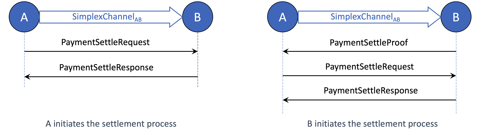
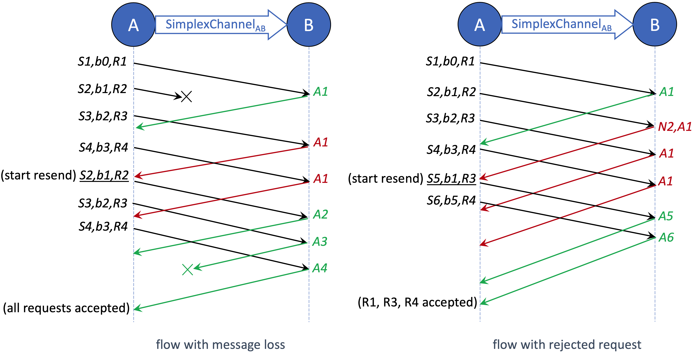

# Single-Hop Protocols

A single-hop conditional payment forms the fundamental building block of the AgentPay network. It underpins the system’s **high performance, robustness, and flexibility**, and serves as the basis for constructing multi-hop and end-to-end payments. Understanding the single-hop conditional payment structure and the associated messaging protocol is essential before exploring the higher-level constructs.

As described earlier, AgentPay adopts a [full-duplex channel model](../on-chain-contracts/core-data-structures.md#duplex-payment-channel) to maximize off-chain throughput. If two peers instead shared a single state struct with one global sequence number, they would need to synchronize every update, introducing contention and latency.

By contrast, a duplex channel splits the shared state into two **unidirectional simplex channels**, each with an independent sequence number. This allows both peers to send payments concurrently without coordination overhead. To prevent race conditions, only the `peer_from` (field 2 of the [simplex channel](../on-chain-contracts/core-data-structures.md#simplex-channel-state)) is permitted to initiate state updates. Each off-chain update follows a simple two-step handshake:

1. The `peer_from` creates a new simplex state, signs it, and sends it to the counterparty.
2. The counterparty verifies the update and returns the co-signed new off-chain state.

Because both simplex directions operate independently yet symmetrically, the following descriptions focus on one direction; the reverse direction functions identically.

***

### Send Conditional Payment

Sending a conditional payment involves creating a new co-signed [simplex channel state](../on-chain-contracts/core-data-structures.md#simplex-channel-state) that adds a new entry to the pending pay list (field 5) and updates related metadata. The process requires one round trip of two off-chain messages — `CondPayRequest` and `CondPayResponse`.

<figure><figcaption></figcaption></figure>

**`CondPayRequest`** — sent by the peer initiating or forwarding a conditional payment. It includes:

* **Payment data** — the immutable conditional payment message defined by the payment source.
* **New one-sig state** — a new simplex state signed by `peer_from`, with an incremented sequence number (field 3), an updated pending pay list (field 5) including the new payment ID, and refreshed metadata (fields 6–7).
* **Base seq** — the sequence number of the previous simplex state serving as the base for this update.
* **Pay note** — an optional metadata field (type `google.protobuf.Any`) for auxiliary information exchanged off-chain.

**`CondPayResponse`** — sent by the receiving peer after validating all data fields in the request. It contains:

* **Co-signed state** — the fully signed simplex state. If the request is valid, this matches the proposed state; otherwise (e.g., invalid sequence number or packet loss), the peer returns its latest known co-signed state to support recovery.
* **Error** — an optional field with the reason for rejection and the sequence number of the failed request. The sender uses this to identify and retry the corresponding message.

***

### Settle Conditional Payment

Once a conditional payment’s outcome is finalized, the two peers can cooperatively settle it off-chain. Settlement involves creating a new co-signed simplex channel state that removes the corresponding payment ID from the pending list (field 5), updates the transferred amount (field 4), and refreshes other relevant metadata.

The process uses up to three off-chain messages — `PaymentSettleRequest`, `PaymentSettleResponse`, and (optionally) `PaymentSettleProof`, which is used when the receiving peer initiates the settlement.

<figure><figcaption></figcaption></figure>

**`PaymentSettleRequest`** is sent by the `peer_from` side of the channel to clear one or more payments. It includes:

* **Payments to be settled** — a list of payment IDs, their settlement reasons (e.g., fully paid, vouched, expired, rejected, on-chain resolved), and the settled amounts.
* **New one-sig state** — a new simplex state signed by `peer_from`, with an incremented sequence number (field 3), an updated pending pay list excluding the settled payments, and revised transfer and total pending amounts (fields 4 and 7).
* **Base seq** — the sequence number of the previous simplex state on which this update is based.

**`PaymentSettleResponse`** is the reply from the receiving peer after verifying the request. It contains the co-signed simplex state and, if any error occurs, an optional error message.

**`PaymentSettleProof`** is used when the receiving peer wants to trigger the settlement process. Since the receiver cannot issue a new one-sig state, it instead sends this message to prompt the `peer_from` to initiate an update. It contains:

* **Vouched payment results** — a list of vouched results co-signed by each payment’s source and destination. The `peer_from` should create settlement requests based on these vouched amounts. This field is only used for multi-hop payments with numeric conditions, which will be detailed later.
* **Payments to be settled** (non-vouched) — a list of payment IDs and reasons (e.g., expired, rejected, on-chain resolved). The `peer_from` should then evaluate the reasons and send settlement requests accordingly.

***

### Send Unconditional Payment

Unlike conditional payments, which require two rounds of simplex state updates (send and settle), an unconditional payment between two peers completes in a single round trip.

AgentPay reuses the same `CondPayRequest` and `CondPayResponse` messages, with the only difference being the content of the **new one-sig state**. In this case, the [simplex state](../on-chain-contracts/core-data-structures.md#simplex-channel-state) includes an incremented sequence number (field 3) and an updated transferred amount (field 4). The receiving peer then finalizes the payment by replying with the new co-signed state.

***

### Sliding Window Protocol

The previous section described the basic single-hop message flow between two channel peers for cooperative simplex state updates. Similar to standard communication systems, if the _peer\_from_ sender waits for a response before sending the next request, throughput is limited by the round-trip time. To improve performance, AgentPay applies a customized [sliding window protocol](https://en.wikipedia.org/wiki/Sliding_window_protocol) for concurrent off-chain state updates.

Unlike TCP or other data transmission protocols, simplex state update messages are not independent packets — each new message depends on the previous simplex state. This means one invalid message invalidates all subsequent messages derived from it. AgentPay modifies the traditional sliding window design to support these dependencies while still achieving high concurrency and throughput.

<figure><figcaption></figcaption></figure>

The figure above illustrates the sliding window workflow under two types of failures: message loss and request rejection. **S** represents the new simplex state, **b** the base sequence number, and **R** the request type (e.g., send or settle). For example, “_S7,b4,R5_” denotes a message carrying a one-signed simplex state with sequence number 7, built on the previous state 4, for request R5. **A** denotes acknowledgment (ACK), and **N** denotes negative acknowledgment (NACK). AgentPay assumes messages may be lost but are always delivered in order, as guaranteed by the underlying transport layer (e.g., [gRPC](https://grpc.io/)).

#### Receiver protocol

On the receiving side, suppose the latest co-signed simplex state has sequence number **n**, and the incoming one-signed state has sequence **s** and base **b**. The receiver follows these rules:

* **Sequence number check** — The request is valid only if _s > n_ and _b == n_. Otherwise, the receiver replies with an error message and an ACK of _n_, indicating it expects the next state to build on _n_.
* **Request validity check** — If the sequence is valid, the receiver further checks the request logic (e.g., payment setup or settlement validity). If the request is invalid, it replies with a NACK for _s_ and an ACK of _n_, signaling that _s_ is rejected and subsequent requests must continue from _n_.

#### Sender protocol

The _peer\_from_ sender maintains local tracking variables: `last_used`, `last_ACKed`, `last_sent`, `base_for_next`, and `last_inflight_after_NACK`. For instance, in the right-hand diagram, after receiving response “N2,A1,” the sender’s internal state becomes:\
`last_used=4`, `last_ACKed=1`, `last_sent=4`, `base_for_next=1`, `last_inflight_after_NACK=4`.

The sender follows these rules:

* **Send request** — Construct each new simplex state with sequence number `last_used + 1`, based on the state with sequence number `base_for_next`, applying the latest off-chain state change.
* **Handle message loss** — If ACKs indicate missing requests, the sender resends starting from the first unacked message. If an ACK is skipped (suggesting a lost ACK), it assumes earlier messages were accepted, since acceptance of a newer state implies acceptance of all prior states.
* **Handle request rejection** — Upon receiving a NACK, all unacked inflight requests based on the rejected state are reconstructed and resent. The sender resets `base_for_next` to `last_ACKed` before resending the first inflight message.
