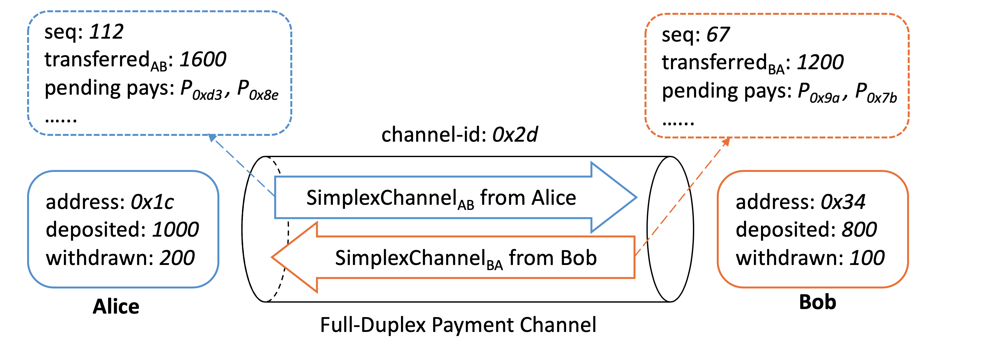

# Core Data Structures

We first introduce the core structural elements of AgentPay, which center on two fundamental concepts: the **duplex payment channel** and the **conditional payment**. Understanding how these components are defined, how they interconnect, and how they are optimized for scalability, efficiency, and security is essential to grasping the overall AgentPay architecture.

***

## Duplex Payment Channel

<figure><figcaption></figcaption></figure>

The figure above illustrates the logical data model of an AgentPay state channel between two peers, Alice and Bob. Not all information shown here resides on-chain. The model consists of two types of peer-related data:

* **On-chain states** (solid boxes) — include peer addresses and the amounts of tokens each has deposited or withdrawn. These minimal records are jointly maintained by the on-chain contracts and the off-chain nodes.
* **Off-chain simplex states** (dashed boxes) — include the cumulative amounts transferred between peers, pending conditional payments, and monotonically increasing sequence numbers. Peers exchange value off-chain by co-signing updated simplex states; the contracts only verify or settle them when required.

AgentPay adopts a **full-duplex channel model** for maximum performance. By splitting the shared state into two independent unidirectional simplex states, both peers can send payments concurrently. This design greatly simplifies off-chain coordination and improves throughput, as will be further detailed in the off-chain protocol section.

### Simplex channel state

A simplex state represents one-directional flow of value within a duplex channel. It is defined using the following protobuf structure, with `proto3` field options aligned to Solidity native types for compatibility with EVM-based smart contracts:

```protobuf
// The simplex channel state from one peer to another.
// Two simplex channels form a full-duplex channel.
message SimplexPaymentChannel {
    // unique channel ID per duplex channel
    bytes channel_id = 1 [(soltype) = "bytes32"];
    // address of the peer who owns and updates the simplex state
    bytes peer_from = 2 [(soltype) = "address"];
    // simplex state sequence number
    uint64 seq_num = 3 [(soltype) = "uint"];
    // amount of token already transferred to peer, monotonically increasing
    TokenTransfer transfer_to_peer = 4;
    // list of pending conditional payment IDs
    PayIdList pending_pay_ids = 5;
    // the last resolve deadline for all pending pays
    uint64 last_pay_resolve_deadline = 6 [(soltype) = "uint"];
    // total locked amount of all pending pays
    bytes total_pending_amount = 7 [(soltype) = "uint256"];
}
```

This protobuf representation is jointly used by both the off-chain protocol and the on-chain contracts across supported blockchains. A simplex state is _valid only if it is co-signed by both peers and has the highest sequence number_.

Given two valid simplex states and the on-chain records of deposits and withdrawals, either peer’s balance can be deterministically computed at any time. For example, the available balance of peer _A_ is:\
`A.available = A.deposit - A.withdraw + B.transfer - A.transfer - A.pending` .

### **List of pending pay IDs**

Details of the payment-related fields in the simplex state (such as conditional payments) will be discussed [later](core-data-structures.md#conditional-payment). Here, we focus on how pending conditional payments are represented in field 5 of the simplex state.

AgentPay does **not** rely on Merkle proofs to summarize pending payments, since maintaining a Merkle root for a rapidly changing dataset is computationally expensive and would require additional on-chain transactions during disputes.

Instead, the list of pending payment IDs is stored **directly** in the simplex state. Sending or clearing a conditional payment off-chain simply involves adding or removing its payment ID from the list (field 5) and, if applicable, updating the transferred amount (field 4).

On-chain contracts never persist the pending pay IDs. When needed, they can parse the list from the submitted input and compute the outcome within a single transaction. The protobuf structure of this list is defined as follows:

```protobuf
// Linked list of PayID lists to record an arbitrary number of pending payments.
// Used in SimplexPaymentChannel field 5.
message PayIdList {
    // list of pay IDs
    repeated bytes pay_ids = 1 [(soltype) = "bytes32"];
    // hash of the next PayIdList
    bytes next_list_hash = 2 [(soltype) = "bytes32"];
}
```

Because every layer-1 blockchain enforces a gas limit on per-transaction data size, AgentPay employs a _linked list of lists_ design to support a potentially large number of pending payments.\
In practice, a single list usually suffices—for example, on Ethereum, a single transaction can process hundreds of pay IDs within a simplex state.

***

## Conditional Payment

Another key component of AgentPay is the **conditional payment** — a programmable token transfer from one peer to another within a unidirectional simplex channel. The payment’s outcome can depend on multiple on-chain or off-chain conditions, with flexible logic defining how these conditions determine the final transfer amount.

The protobuf representation of a conditional payment is shown below:

```protobuf
// Globally unique and immutable conditional payment.
// The hash of this message is used to compute the pay ID in PayIdList field 1.
message ConditionalPay {
    // the unix nanoseconds timestamp, help ensure payment uniqueness
    uint64 pay_timestamp = 1 [(soltype) = "uint"];
    // public key used by pay source to vouch the pay result
    bytes src = 2 [(soltype) = "address"];
    // public key used by pay destination to vouch the pay result
    bytes dest = 3 [(soltype) = "address"];
    // list of generic conditions for the payment
    repeated Condition conditions = 4;
    // payment amount resolve logic based on condition outcomes.
    TransferFunction transfer_func = 5;
    // deadline for the pay to be resolved on-chain
    uint64 resolve_deadline = 6 [(soltype) = "uint"];
    // challenge time window to resolve a pay on chain
    uint64 resolve_timeout = 7 [(soltype) = "uint"];
    // address of the pay resolver contract
    bytes pay_resolver = 8 [(soltype) = "address"];
    // chain id of the intended target chain
    uint64 chain_id = 9 [(soltype) = "uint"];
}
```

All fields are defined by the payment source and remain **immutable** as the payment is relayed across multiple hops. Each payment is identified by a globally unique ID computed as:\
`payID = Hash(Hash(pay) + pay.pay_resolver)`. This ensures determinism and binding to a specific resolver contract (see [PayRegistry](contracts-architecture.md#payregistry) for details).

**Note on decoupled architecture:** A conditional payment cleanly separates **condition resolution** from **fund allocation**. Each `Condition` may reference an on-chain or off-chain contract that exposes standardized interfaces to verify finality and retrieve outcomes, while the `TransferFunction` interprets those outcomes to compute the final payment amount. This modular design gives AgentPay high flexibility and robustness, supporting use cases from simple hashlocks to complex application-driven settlements with minimal complexity and cost.

### Condition

Each conditional payment can include one or more `Condition` entries, defining the logic that determines whether and how much value should be transferred. The `TransferFunction` (described later) takes these condition outcomes as inputs to compute the final payment amount.

```protobuf
// Condition of a payment, used in ConditionalPay field 4.
message Condition {
    // three types: hash_lock, deployed_contract, virtual_contract
    ConditionType condition_type = 1;
    // one of the following three fields:
    // 1. hash of the secret preimage
    bytes hash_lock = 2 [(soltype) = "bytes32"];
    // 2. onchain deployed contract
    bytes deployed_contract_address = 3 [(soltype) = "address"];
    // 3. offchain virtual contract
    bytes virtual_contract_address = 4 [(soltype) = "bytes32"];
    // arg to query condition status from the deployed or virtual contract
    bytes args_query_finalization = 5;
    // arg to query condition outcome from the deployed or virtual contract
    bytes args_query_outcome = 6;
}
```

A condition can be of three types:

* **Hash Lock Condition** — used to secure multi-hop payments. The payment includes a hash `h`  of a secret preimage; it can only be resolved on-chain once the preimage `v` is revealed.
* **Deployed Contract Condition** — references an on-chain contract that defines arbitrary application logic. The contract must expose standardized interfaces `isFinalized` and `getOutcome`, which the AgentPay contracts call using the arguments in fields 5 and 6.
* **Virtual Contract Condition** — represents an off-chain “virtual” contract maintained by involved peers (e.g., payment source and destination). It is only deployed on-chain if a dispute arises. The on-chain system locates it via a unique identifier (field 4), derived from the hash of the virtual contract code, initial state, and a nonce.

**Note on decoupled architecture:** `getOutcome` provides a unified interface for retrieving any application-defined result that can be interpreted into payment resolution logic. This clear separation between **application state** and **fund allocation** gives AgentPay maximum flexibility to support a wide range of contract types and condition combinations.

### Transfer function

Once all conditions have been finalized, the `transfer_func` field in the `ConditionalPay` message determines how the payment amount is computed. Each condition can yield either a boolean or numeric outcome, and the transfer function defines how these outcomes are combined to resolve the final amount. AgentPay supports multiple flexible resolution logics, as shown below:

```protobuf
// Payment result resolving function — takes pay.conditions as input.
// Used in ConditionalPay field 5.
message TransferFunction {
    // amount resolving logic based on the condition outcome
    TransferFunctionType logic_type = 1;
    // maximum token transfer amount of this payment
    TokenTransfer max_transfer = 2;
}

enum TransferFunctionType {
    BOOLEAN_AND = 0;     // pay full amount if every condition is true
    BOOLEAN_OR = 1;      // pay full amount if any condition is true
    BOOLEAN_CIRCUIT = 2; // customized boolean circuit logic
    NUMERIC_ADD = 3;     // pay the sum of all condition outcomes
    NUMERIC_MAX = 4;     // pay the max of all condition outcomes
    NUMERIC_MIN = 5;     // pay the min of all condition outcomes
}
```

This flexible abstraction enables a wide spectrum of applications — from simple multi-signature or hashlock-based transfers to programmable contracts that distribute value according to computation results, oracle feeds, or aggregated off-chain metrics.

**To summarize**, `ConditionalPay` is a self-contained structure that encapsulates all information defining a conditional payment — including its participants, conditions, resolution logic, and resolver contract. Later pages will describe how these payments are exchanged off-chain and how they interact with the on-chain contracts during settlement or dispute.

***

## On-Chain States

The two fundamental components introduced earlier — the **duplex payment channel** and the **conditional payment** — form the basis for AgentPay’s on-chain operations.&#x20;

This section describes the data structures maintained by the AgentPay smart contracts. While implementations may vary slightly across different blockchains, the core structure remains consistent.

Below is an example based on the Solidity implementation:

```solidity
// Mapping from channel ID to its duplex channel state
mapping(bytes32 => Channel) channelMap;

// Information of a duplex channel
struct Channel {
    // current state in the channel state machine
    ChannelStatus status;
    // token supported by this channel
    PbEntity.TokenInfo token;
    // time window to challenge a unilateral request
    uint disputeTimeout;
    // the deadline to challenge a unilateral channel settling request
    uint settleFinalizedTime;
    // information about the two peers, detailed below
    PeerProfile[2] peerProfiles;
    // fields tracking withdrawal requests (omitted for simplicity)
    ...
}

// Information of each channel peer
struct PeerProfile {
    address peerAddr; // on-chain account address
    uint deposit;     // total deposited amount (monotonically increasing)
    uint withdrawal;  // total withdrawn amount (monotonically increasing)
    PeerState state;  // latest snapshot of the peer’s simplex state, detailed below
}

// Snapshot of a peer’s simplex state,
// stored when a peer initiates a dispute or records an off-chain state
struct PeerState {
    uint seqNum;                 // sequence number (field 3 of SimplexPaymentChannel)
    uint transferOut;            // amount transferred to the other peer (field 4)
    uint lastPayResolveDeadline; // latest resolve deadline (field 6)
    uint pendingPayOut;          // total locked pending amount (field 7)
    bytes32 nextPayIdListHash;   // hash of next PayIdList for pending payments
}
```

The above structures store **per-channel** state information.

In addition, AgentPay maintains a global registry of resolved payments, which records the final on-chain outcomes of individual conditional payments:

```solidity
// Mapping from payID to payment resolution information
mapping(bytes32 => PayInfo) public payInfoMap;

struct PayInfo {
    uint amount;          // final resolved payment amount
    uint resolveDeadline; // challenge deadline, ≤ field 6 of ConditionalPay
}
```

These compact, carefully scoped data structures ensure minimal on-chain footprint while preserving complete verifiability of every channel’s state and payment outcome.
