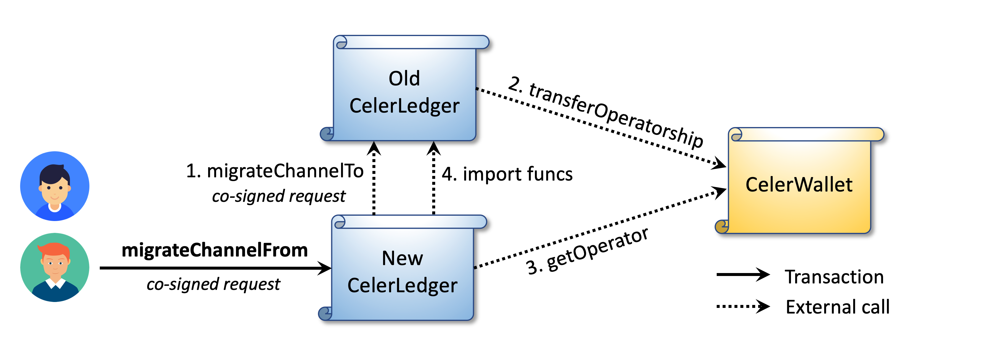

# Decentralized Versioning

Smart contracts are immutable once deployed, so evolving them safely has always been a challenge. Traditional upgrade patterns—such as proxy-based architectures—centralize control in an upgrade admin and rely on fragile `delegatecall` mechanics that demand strict storage layout consistency. This introduces operational risk and undermines decentralization.

AgentPay takes a different approach through **decentralized, version-based evolution**. Instead of mutating contract code via proxies, new versions of logic contracts are deployed independently. Each payment channel is jointly controlled by its two peers, who can **cooperatively migrate** their channel to a newer version at any time—without global coordination, admin keys, or downtime.

This design achieves two goals:

* **Trustless control** — only the channel peers can decide which contract version governs their funds and state transitions.
* **Seamless migration** — peers can switch logic versions while keeping their existing balances and history intact, enabling smooth feature upgrades and bug fixes without interrupting off-chain operations.

In this architecture:

* **CelerLedger** and **PayResolver** are _versioned modules_, representing the system’s programmable logic layer that may evolve over time.
* **CelerWallet**, **PayRegistry**, and **VirtContractResolver** are _permanent modules_ that store assets and critical data. These remain stable, with minimal logic and no upgrade surface.

Together, this structure preserves the immutability and auditability of asset-holding contracts, while allowing rapid iteration and feature evolution in the channel and payment logic.

***

### Versioning PayResolver

As described in [Resolve Payment](channel-operations.md#resolve-payment), **PayResolver** defines the on-chain logic for resolving conditional payments and records results in the global **PayRegistry**. Each conditional payment specifies its resolver  address (field 8 of `ConditionalPay`), which determines how its conditions are verified and finalized.&#x20;

Because PayResolver governs the final outcome of payments, each agent node maintains its own **accepted resolver list** and only acknowledges payments referencing resolvers it trusts.

When a new PayResolver version is deployed—whether to add features, support new condition types, or fix issues—nodes can upgrade _independently and without any on-chain transaction_:

1. Relay nodes add the new PayResolver contract to their local whitelist.
2. Payment sources begin referencing the new contract in subsequent conditional payments.

This decentralized process avoids downtime and centralized control: each node freely chooses which resolver versions to trust and adopt. If a source uses a new resolver that a relay does not yet accept, the payment will simply be rerouted or rejected—preserving both autonomy and safety across the network.

***

### Versioning CelerLedger

As introduced in Contracts Architecture, **CelerLedger** manages payment channel logic, while **CelerWallet** securely holds assets. Each wallet has multiple owners (the channel peers) and a single operator — its associated ledger contract. Different channel pairs may choose different CelerLedger versions, all interacting with the same CelerWallet contract.

AgentPay allows **channel peers to cooperatively migrate** their CelerLedger to a new version while continuing to use the same wallet, with _zero off-chain downtime_.

#### **CelerLedger migration process**

Migration requires mutual consent from both channel peers via a co-signed migration message:

```protobuf
message ChannelMigrationInfo {
    bytes channel_id = 1 [(soltype) = "bytes32"];
    bytes from_ledger_address = 2 [(soltype) = "address"];
    bytes to_ledger_address = 3 [(soltype) = "address"];
    uint64 migration_deadline = 4 [(soltype) = "uint"];
}
```

Anyone can complete the migration by submitting this message to the **new** CelerLedger’s `migrateChannelFrom` API.

<figure><figcaption></figcaption></figure>

As illustrated above, the migration consists of four inter-contract calls within one transaction:

1. The **new ledger** invokes `migrateChannelTo` on the **old ledger**.
2. The **old ledger** transfers wallet operatorship to the new ledger.
3. The **new ledger** verifies the transfer via the wallet’s `getOperator` function.
4. The **new ledger** imports state data from the old ledger to initialize the channel entry.

A migration request has higher priority than `intendSettle`, meaning peers can migrate even if the channel is in a `Settling` state. Upon migration, the channel becomes `Operable` again. This enables **immediate off-chain upgrades with deferred on-chain finalization**: once a migration is co-signed, peers can begin operating under the new logic off-chain before the transaction is executed.

#### **Zero-downtime upgrade flow**

Channel peers do not need to pause off-chain operations when migrating to a new CelerLedger version. The new logic becomes effective _as soon as the migration request is co-signed_, while the on-chain transition can be finalized later before the deadline. During this period, peers should monitor events from both the old and new ledgers.

If the `SimplexPaymentChannel` message format remains unchanged, peers only need to co-sign the migration request and can continue exchanging off-chain payments seamlessly.

If the proto definition changes, peers must first co-sign equivalent states using the new format (representing the same balances as the old states), then co-sign the migration request and continue under the new logic.

#### **Manual fallback upgrade**

In rare cases where automated migration fails (e.g., due to critical ledger bugs), peers can still cooperatively update the wallet operator through `CelerWallet.proposeNewOperator`. If all owners agree on the new operator, the wallet updates accordingly. This manual path should only be used as a last resort.

***

### Summary

AgentPay’s decentralized versioning framework achieves the rare balance between **immutability and evolvability**. Critical asset-holding contracts like CelerWallet and PayRegistry remain permanently secure and stable, while logic modules such as CelerLedger and PayResolver can evolve through cooperative peer-driven migration. This design eliminates centralized upgrade control, avoids the centralization and fragility of proxy-based patterns, and enables the network to upgrade safely, flexibly, and without interrupting off-chain operations.

The next section, [Off-chain Protocol](../off-chain-protocols/), builds on these on-chain primitives to describe how agents exchange and synchronize channel states, route payments across the network, and ensure instant off-chain finality with on-chain enforceability.
