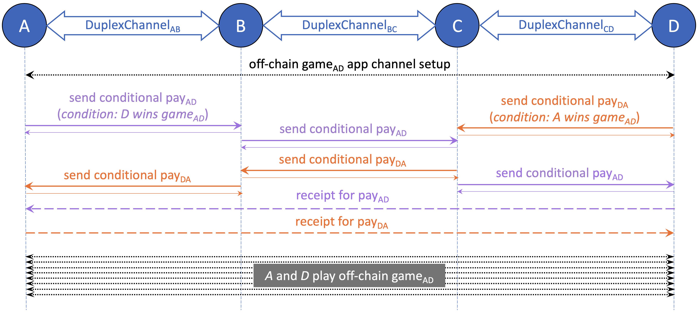
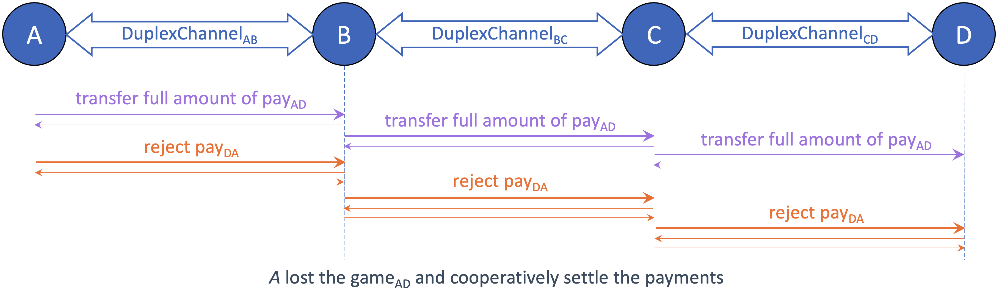
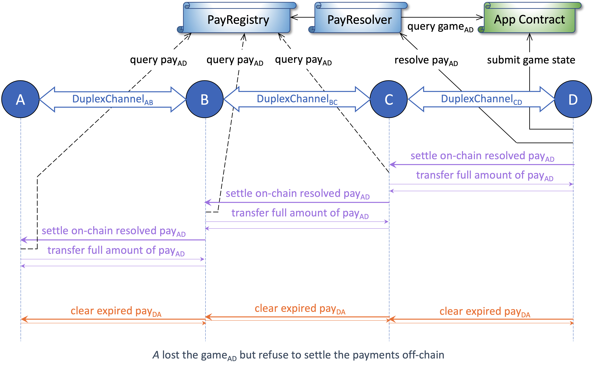

# App Contracts and Protocols

As described in the previous sections, AgentPay enables high-throughput, multi-hop conditional payments where each dependency is expressed through a lightweight query interface. This framework naturally extends beyond financial transfers to power autonomous AI Agent applications that rely on programmable coordination and verifiable outcomes.

These applications may include not only oracle queries, NFT settlements, ENS ownership checks, or rollup state validations, but also **arbitrary off-chain computations**—such as AI model inference, data processing, or simulation tasks—**that can be ZK-verified or otherwise attested on-chain**. Through AgentPay’s unified conditional interface, such tasks can trigger immediate, trustless, and composable payments once their outcomes are verified.

App contracts, together with their off-chain protocols, form **generalized state channels** that define multi-party logic and produce outcomes consumable by AgentPay. They are modular, secure, and cost-efficient, enabling AI agents (or human participants) to interact, trade, and coordinate entirely off-chain under normal conditions. **When all parties behave cooperatively, the entire lifecycle—from channel creation to final settlement—incurs zero on-chain transactions.** The App contract only comes on-chain if a dispute occurs, where it provides a fully trustless and gas-efficient resolution path, ensuring autonomous and verifiable execution even in adversarial scenarios.

***

## Required App Contract Interface

Any **on-chain deployed contract** or **virtual contract** (instantiated off-chain and deployable on demand) can serve as an App contract in the AgentPay ecosystem, as long as it exposes two standard query functions used as payment conditions: `isFinalized`, which checks whether the app outcome is finalized, and `getOutcome`, which returns its boolean or numeric result.

```solidity
// Interface for app contracts with boolean outcomes
interface IBooleanOutcome {
    function isFinalized(bytes calldata _query) external view returns (bool);
    function getOutcome(bytes calldata _query) external view returns (bool);
}

// Interface for app contracts with numeric outcomes
interface INumericOutcome {
    function isFinalized(bytes calldata _query) external view returns (bool);
    function getOutcome(bytes calldata _query) external view returns (uint);
}
```

Each function accepts a generic `bytes` argument to support arbitrary query formats and logic. These are the **only requirements** AgentPay imposes—AgentPay does not assume or depend on how an app computes, verifies, or finalizes its state. This abstraction allows any AI-agent application, oracle, rollup, or ZK-verified computation to plug in as a payment condition seamlessly.

**Byzantine application behavior:** A natural concern is what happens if an app behaves unpredictably—e.g., `isFinalized` flips between true and false, or `getOutcome` yields nondeterministic results. The AgentPay protocol is designed to be **Byzantine-resilient**: conditional payments are cryptographically isolated from app correctness. Even if an app misbehaves, the network’s payment safety is preserved, and disputes can always be resolved trustlessly through on-chain verification.

***

## End-to-End Integrated Workflow

Integrating an App with AgentPay is straightforward. Any App outcome—whether generated by an on-chain or off-chain virtual contract—can directly trigger an off-chain token transfer through AgentPay’s conditional payment interface.

To illustrate, consider a simple example with two participants (or AI agents) interacting in an App channel that represents a competitive or cooperative task. When the App outcome is finalized—such as determining the winner of a game, verifying a ZK-proof, or completing a joint computation—AgentPay automatically settles payments according to the predefined conditions.

For simplicity, this section uses a two-player game as the example: both players lock funds into an AgentPay channel, and conditional payments are made based on who wins. More complex cases, including multi-party collaborations, tiered numeric payouts, or probabilistic reward distributions, follow the same workflow pattern.

### **Play the Game with Conditional Payments to the Winner**

<figcaption></figcaption>

Figure above shows the message flow during the game setup and playing phase. _A_ and _D_ are players of an off-chain game App channel. Black lines represent messages related to game logic, while purple and orange lines represent conditional payment messages from _A_ and _D_, respectively. Dashed lines indicate direct communication between _A_ and _D_, without involving relay nodes.

The steps are summarized as follows:

1. _A_ and _D_ set up the game App channel by exchanging initial parameters such as match information, prize amount, and the virtual or deployed game contract address. **Neither virtual nor deployed App contract requires any on-chain initialization for the game channel.**
2. Each player sends a [conditional payment](off-chain-protocols/end-to-end-protocols.md#set-up-end-to-end-conditional-payment) to the opponent following the end-to-end conditional payment setup flow. The payments are symmetric: _“pay the opponent the winner’s prize if the opponent wins.”_ The two payment routes may differ. The game begins once both conditional payments are received.
3. _A_ and _D_ then play the game entirely off-chain by exchanging signed game states until reaching an outcome, either cooperatively or (if needed) through an on-chain settlement.

**Note on state progression:** The integrated workflow is agnostic to how App states evolve or settle. Any App channel logic or state progression protocol can be seamlessly supported within this framework.

### **Settle the Payments When the Loser Is Cooperative**

<figcaption></figcaption>

Figure above shows the message flow when _A_, after losing the game off-chain, follows the protocol to settle payments cooperatively. The honest loser _A_ initiates the settlement of both conditional payments: [paying the full amount](off-chain-protocols/end-to-end-protocols.md#source-pays-in-full-amount-on-true-outcome) for its own conditional payment to _D_, and [rejecting the conditional payment](off-chain-protocols/end-to-end-protocols.md#destination-rejects-the-payment-on-false-outcome) from _D_. The workflow completes once the winner _D_ confirms settlement of both payments.

**There are zero on-chain transactions throughout the entire lifecycle**—from when the two players agree to play the game, to the final prize distribution—so long as all participants behave cooperatively. The App contract and its logic remain purely virtual and only need to appear on-chain in the rare case of a dispute.

### **Settle the Payments When the Loser Is Uncooperative**

<figcaption></figcaption>

Figure above shows the message flow when _A_ loses the game but refuses to settle the conditional payments off-chain. To claim the prize, the winner _D_ initiates a dispute, resolves the payment on-chain, and completes settlement with its upstream peer. **Relay nodes (**_**B**_**&#x20;and&#x20;**_**C**_**) never need to perform any on-chain transactions**, even when the end players (_A_ and _D_) fail to cooperate.

The workflow proceeds as follows:

1. The winner _D_ initiates an on-chain dispute by submitting the latest off-chain game state to the on-chain App contract.
   * If the game was based on a **virtual App contract**, _D_ first deploys it through the [VirtContractResolver](on-chain-contracts/contracts-architecture.md#virtcontractresolver).
   * If the submitted state is not final, _D_ may continue on-chain gameplay until the outcome becomes finalized.
2. Once the outcome is finalized, _D_ [resolves the conditional payment on-chain](on-chain-contracts/channel-operations.md#resolve-payment-by-conditions). The [PayResolver](on-chain-contracts/contracts-architecture.md#payresolver) queries the outcome from the App contract and records the result into the [PayRegistry](on-chain-contracts/contracts-architecture.md#payregistry).
3. _D_ and all relay nodes then [settle the on-chain resolved payment](off-chain-protocols/end-to-end-protocols.md#settle-the-payment-on-chain) with their respective upstream peers. If any peer remains uncooperative, the downstream node can close the payment channel on-chain to finalize settlement.
4. The conditional payment from the winner _D_ to the loser _A_ is canceled. If _A_ fails to reject the payment, all peers simply wait until it expires and then clear it. _D_ may also resolve it on-chain earlier to accelerate cleanup.

This end-to-end workflow highlights two key architectural advantages of the **decoupled App and payment channels**:

* **App flexibility:** Players (_A_ and _D_) can use any App channel framework—off-chain, on-chain, or hybrid—while still linking its outcome to token transfers seamlessly.
* **Relay simplicity:** Relay nodes (_B_ and _C_) only forward payment messages and never interact with the App logic or perform on-chain actions, enabling a highly scalable and low-overhead network.

***

### Summary

The App Contracts and Protocols layer provides the foundation for **generalized, trustless off-chain computation and interaction** in the AgentPay network.&#x20;

By decoupling App logic from payment settlement, the architecture allows any task—ranging from simple Boolean decisions to complex, multi-party computations verified by zero-knowledge proofs—to directly trigger token transfers without requiring custom payment code or on-chain dependency during normal operation.

In fully cooperative cases, the entire lifecycle of an App—initialization, interaction, and settlement—occurs **completely off-chain with zero gas cost**. When disputes arise, the same App logic can be **selectively materialized on-chain** to produce verifiable outcomes, ensuring security and fairness without compromising scalability.

This design makes AgentPay not just a payment network, but a **universal coordination fabric** for AI agents and smart applications—capable of autonomously transacting, reasoning, and resolving outcomes across both virtual and on-chain environments.
