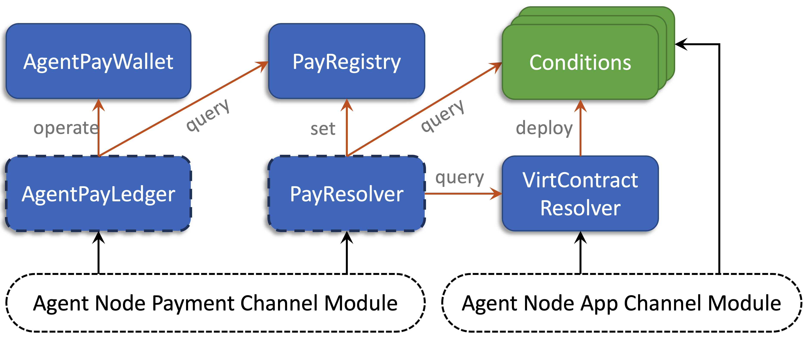

# Contracts Architecture

<figcaption></figcaption>

The figure above illustrates the AgentPay on-chain contract architecture. The white dashed boxes at the bottom represent user-side off-chain components. Each colored rectangle denotes an individual on-chain contract: blue modules are **AgentPay core contracts** (those with dashed borders are _versioned contracts_ that can evolve over time through peer-agreed migration), while green modules represent **external condition contracts** defined by applications. Orange arrows indicate inter-contract function calls with their primary purpose, and black arrows show user interactions from Agent nodes.

The modular design separates critical asset custody from evolving business logic, enabling safer upgrades and clearer responsibilities. This section provides a high-level overview of all AgentPay contracts and their relationships. The detailed channel operations and workflows are described later in the [Channel Operations](channel-operations.md) section.

### AgentPayWallet

The AgentPayWallet contract maintains multi-owner, multi-token wallets for all AgentPay channels. It serves purely as a **secure asset custodian**, holding users’ tokens without embedding any payment or business logic — those responsibilities reside in the **AgentPayLedger** contract.

Each wallet defines two distinct roles:

* **Owners** — the channel peers who jointly own the wallet and receive withdrawn funds.
* **Operator** — a single contract (typically a AgentPayLedger) authorized to manage wallet operations. The operator can (1) withdraw funds on behalf of owners and (2) transfer operatorship to another ledger version during a coordinated migration.

AgentPayWallet exposes only the minimal, highly-audited functions needed to create wallets, deposit and withdraw tokens, and transfer operatorship. This simplicity makes it extremely robust and safe. A single AgentPayWallet contract is shared across the entire network. Channel peers never interact with it directly; instead, they access their funds through its operator — the AgentPayLedger contract described next.

### AgentPayLedger

The AgentPayLedger contract is the core of all AgentPay on-chain logic and the **primary entry point** for most [on-chain user operations](channel-operations.md). It defines the AgentPay channel state machine, maintains the core payment channel logic, acts as the operator of **AgentPayWallet** to manage token assets, and exposes a comprehensive set of APIs for peers to open, update, and settle channels.

During execution, AgentPayLedger interacts with other contracts to coordinate channel operations:

* **AgentPayWallet** — handles deposits, withdrawals, and operatorship transfers.
* **PayRegistry** — retrieves resolved payment results when finalizing settlements.

AgentPayLedger is implemented as a [versioned contract](decentralized-versioning.md), allowing peers to migrate to newer ledger versions by mutual agreement. Unlike the single global AgentPayWallet, multiple ledger versions can coexist — each channel pair freely selects and migrates to the version they trust, ensuring flexibility and continuous operation without network downtime.

### PayResolver

The PayResolver contract defines the **on-chain logic for resolving conditional payments**. It provides simple APIs that allow an agent to finalize a payment on-chain when cooperative off-chain resolution is not possible.

When executed, PayResolver interacts with several other contracts to complete the resolution process:

* **PayRegistry** — records the finalized payment amount in the global registry.
* **Conditions** — queries outcome data from external application or condition contracts.
* **VirtContractResolver** — retrieves the deployed address of a virtual contract when needed for on-chain dispute resolution.

PayResolver is implemented as a [versioned contract](decentralized-versioning.md), allowing the payment source to specify which resolver version to use for each payment (field 8 of the [ConditionalPay message](core-data-structures.md#conditional-payment)). The resolver address is embedded in the computation of each payment’s unique ID, ensuring that payment results are tightly bound to their designated resolver logic and cannot be tampered with retroactively.

### PayRegistry

The PayRegistry contract serves as the **global record of finalized payment results**. It provides a simple interface for registering resolved payment amounts, indexed by a unique payment ID.

Each payment ID is computed as: `payID = Hash(Hash(pay), setterAddress)`, where `setterAddress` is typically the address of the designated **PayResolver**. This ensures that only the resolver explicitly specified in the [ConditionalPay message](core-data-structures.md#conditional-payment) (field 8) can record the result for that payment.

Once a payment result is written to the PayRegistry, it becomes **immutable and publicly accessible**. Any channel that includes the corresponding conditional payment can then use the recorded result—either off-chain or on-chain—to finalize settlement.

### VirtContractResolver

The VirtContractResolver contract is responsible for **instantiating off-chain virtual contracts** when a dispute requires them to be brought on-chain. It establishes a mapping from each virtual contract’s identifier (field 4 of the [Condition message](core-data-structures.md#condition)) to its deployed on-chain address.

Once instantiated, the virtual contract becomes an **on-chain addressable condition contract** that the **PayResolver** can query via its standard `isFinalized` and `getOutcome` interfaces to resolve payments involving virtual contract conditions.

### Conditions

Conditions are external application contracts that define the logic behind conditional payments. They are not part of the AgentPay core contracts but are queried by the **PayResolver** through the standard `isFinalized` and `getOutcome` interfaces during payment resolution.

A condition contract can be either a **deployed on-chain contract** or an **instantiated virtual contract** brought on-chain through the VirtContractResolver. Any smart contract that implements these two interfaces can serve as a valid condition for AgentPay payments, enabling flexible and composable off-chain logic that remains verifiable on-chain when needed.
