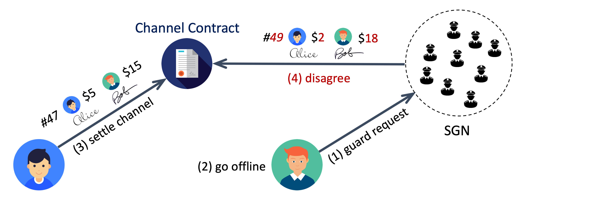

# SGN as Channel Guardian

The **Channel Guardian service** is the original fundamental mission of the State Guardian Network (SGN). It eliminates the [off-chain availability risks](off-chain-availability-problem.md) of AgentPay channels by allowing an Agent (or user) to safely go offline after securely registering its latest off-chain state with SGN.

Once registered, SGN validators collectively store cryptographic commitments of that state and continuously monitor the blockchain for dispute or settlement attempts involving the guarded channel. If a malicious or outdated state is submitted on-chain, SGN automatically responds with the correct one on behalf of the offline Agent, ensuring full fund safety without requiring user uptime.

***

## Service Flow

<figure><figcaption></figcaption></figure>

Figure above illustrates the basic Channel Guardian service flow. The numbers in parentheses indicate the sequence of events:

1. The Agent submits a `guardRequest` to SGN, containing its latest signed state commitment.
2. The Agent can then safely go offline — the state is now cryptographically protected by SGN.
3. If the channel peer later tries to settle the channel on-chain with an older state, SGN validators detect the `IntendSettle` event.
4. Validators compare the attempted state’s sequence number with the guarded one and automatically respond on-chain if the guarded version is newer.

The guarded state can also be retrieved through the SGN’s off-chain `getChannelState` API whenever the Agent reconnects.

SGN offers two service modes, giving Agents flexibility between **speed** and **privacy**.

### Fast Mode

In Fast Mode, the guard request includes the latest co-signed state proof. When a settlement attempt is detected, the assigned SGN guardian simply submits the `intendSettle` transaction with this guarded state proof. After the settlement process completes, the channel can be finalized by any participant via the standard `confirmSettle` transaction.

This mode provides the lowest latency and simplest workflow, suitable for most use cases where privacy is not a primary concern. Although validators see sequence numbers and aggregate balance proofs, they cannot infer detailed payment routes or conditions. Off-chain transactions under Fast Mode already provide better privacy than on-chain transfers.

### Private Mode

For users requiring stronger privacy guarantees, Private Mode limits what information is revealed to SGN. Instead of sending the full state proof, the Agent provides only the minimal tuple:

```
cps = <channel_id, peer_from, seq_num, signatures>
```

This allows SGN to protect the channel by issuing a `vetoSettle` transaction against any outdated settlement attempt without seeing detailed balances or payment metadata.

Optionally, the Agent may also include an **encrypted full co-signed state proof** purely for backup — ensuring recoverability without exposing data.

To maintain consistency and prevent abuse, the peers must follow a safe off-chain message order when exchanging and signing `cps` data:

1. _A_ sends _B_ the new simplex state signed by _A_.
2. _B_ replies with its signature for both the full simplex state and the separate `cps` data.
3. _A_ then signs _B_’s `cps`, completing the handshake.

This ensures no peer can block the channel closure by indefinitely vetoing settlements.

***

## **Guardian Assignment and Incentives**

SGN validators collectively serve as decentralized _channel guardians_, providing continuous on-chain monitoring and timely response services that protect AgentPay channels during dispute windows. Each validator independently tracks on-chain events and collectively reaches consensus within SGN when a guarded channel requires action.

### Assignment Model

For every guarded channel, SGN selects a subset of validators as _active guardians_, with the remainder serving as _standby guardians_. When a settlement attempt is detected on a guarded channel:

* Validators independently verify the event and may broadcast a valid guard transaction after a short randomized delay determined by their assignment order.
* The first valid on-chain transaction finalizes the protection, preventing outdated or malicious channel states from being confirmed.
* All validators observe and agree on the event within SGN through the same event-sync and consensus mechanism already used for cross-chain message verification in cBridge and CelerIM.

This model enables fast, decentralized, and reliable protection without redundant transactions or coordination overhead.

### Economic Incentives

Each AgentPay channel can register a **guard service fee**, which may be structured as either a per-request fee or a recurring subscription fee.\
This fee is divided into two parts:

1. **Active Guard Reward:** Granted to the validator that first submits a valid on-chain guard transaction when a dispute occurs.
2. **Baseline Staking Reward:** Periodically distributed to all SGN validators, weighted by staking power, for maintaining continuous monitoring availability.

If no on-chain settlement is ever triggered—which is the expected case under normal cooperative operation—the validator network still receives the baseline staking reward from accumulated subscription fees, reflecting its ongoing availability and coverage commitment.

This model ensures that validators are **rewarded both for readiness and for action**, sustaining long-term participation while keeping user costs predictable and minimal.

### Accountability and Reputation

Each validator maintains a **guardian reliability score** based on measurable performance metrics, including uptime, event monitoring responsiveness, and historical success in submitting valid guard transactions.

Validators with higher scores gain higher assignment priority for future guard requests and receive proportionally greater reward shares from the baseline staking distribution. Occasional missed events only affect reputation and future assignment weighting—without risking stake slashing—whereas deliberate protocol violations, such as falsifying SGN consensus or submitting invalid guard proofs, remain subject to on-chain penalties.

This model ensures **trust-any safety** for users while preserving a **validator-friendly and sustainable** operating environment that rewards consistent service quality over time.

***

## **Security Model**

SGN provides **trust-minimized availability assurance** for AgentPay channels through a hybrid of BFT consensus and open validator participation.

When an agent submits a guard request, it is confirmed through SGN’s on-chain-staked validator consensus—ensuring that the request is durably recorded and cryptographically verifiable. Once accepted, **any single honest validator** among the active set is sufficient to guarantee successful protection of the guarded channel, since one valid on-chain guard transaction fully prevents malicious settlements.

Security and reliability rest on three pillars:

1. **Consensus integrity:** Guard requests are finalized only after confirmation by >2/3 validator voting power, making them tamper-proof within SGN’s consensus layer.
2. **Liveness assurance:** Because multiple validators independently monitor on-chain events, the system remains live and responsive as long as at least one assigned or standby guardian acts correctly within the dispute window.
3. **Economic alignment:** The reward and reputation mechanisms align validator incentives with both correctness and responsiveness—ensuring that protecting user channels is always economically rational.

This architecture combines **BFT-grade consistency** with **trust-any liveness**, delivering strong availability guarantees and verifiable accountability while avoiding harsh slashing for honest mistakes.

***

## **Scalability**

SGN scales horizontally by running **multiple parallel chains** under the same validator set and staking logic. Each chain provides an independent service—such as channel state guarding, or inter-chain bridging—and can process requests in parallel without shared global state or double-spend risks.

Even the channel guardian service can be sharded into many parallel sub-chains, each responsible for a subset of channels, enabling protection for **millions of active AgentPay channels** while maintaining the same decentralized security guarantees. All chains follow the same validator staking and slashing rules, ensuring consistent security and economic alignment across the entire SGN ecosystem.

***

## **Integration with AgentPay and App Channels**

By serving as a **decentralized availability layer**, SGN completes the trustless lifecycle of AgentPay and App channels. AI Agents and human users alike can now participate in off-chain interactions — payments, cooperative apps, or verifiable computations — without maintaining continuous online presence or centralized custody. Once an Agent registers its guarded state, **SGN validators act as always-on watchers**, ensuring that no outdated or malicious state can ever be finalized on-chain.

This architecture removes the last operational weakness of state channels — availability dependence — and extends the proven, production-grade **SGN validator infrastructure** (already securing billions in cross-chain value) to also protect **off-chain economic activity and autonomous agent execution**.

With this integration, AgentPay becomes a **fully self-securing, always-protected off-chain network**, enabling a new generation of scalable, autonomous, and verifiable AI-driven interactions.
